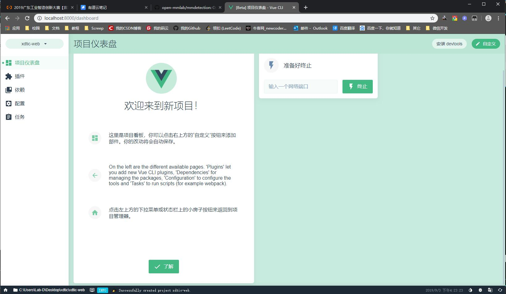

# 2019TIC vue 入门培训

简易入门培训，主要包括三个内容：

1. 介绍MVVM与MVC，引出Vue和现代前端。
2. 介绍Vue的组件开发理念。
3. 练习：如何构建一个Vue组件和Vue项目。

## Outline

1. What is MVVM? And differences with MVC.

We don't even care about the dom-tree. See examples below:

With JQuery or Origin-JS:
```
<p id="name">TIC</p>
-------------
$('#name').text('XDTIC');
document.getElementById('name').innerHTML = 'XDTIC';
```

Now, with Vue.js:
```
<p>{{name}}</p>
-------------
app.name = 'XDTIC';
```

2. How it work?

> @see `/hello-world/Calculator.vue`

3. Tools we need and what is vue-cli

Install **vue-cli**: `npm install -g @vue/cli`

4. Introduce：hello-vue

> You need to install an extra plugin：`npm install -g @vue/cli-service-global`

Create File `/hello-world/HelloVue.vue`:
```
<template>
  <h1>Hello Vue!</h1>
</template>
```

Use shell command: `vue serve /hello-world/HelloVue.vue`, your work will online on <a href="http://localhost:8080">http://localhost:8080</a>

## Practice

### 1.Implement Github Login-Track

Compelete An Vue-Component Like this:


> @See `/login-trace/LoginTrace.vue`
> Use: `vue serve ./login-trace/LoginTrace.vue` to preview the example.

- When mouse hover on any login-trace-block, it should pop-out the date string.
- When AJAX is not finished, you need set a loading info.
- Module every login-trace-block.

Documents you may need:

- `title`:[https://www.w3school.com.cn/tags/att_standard_title.asp](https://www.w3school.com.cn/tags/att_standard_title.asp)
- `v-if`:[https://cn.vuejs.org/v2/guide/conditional.html](https://cn.vuejs.org/v2/guide/conditional.html)
- `v-for`:[https://cn.vuejs.org/v2/guide/list.html](https://cn.vuejs.org/v2/guide/list.html)
- `vue-component`:[https://cn.vuejs.org/v2/guide/components-registration.html](https://cn.vuejs.org/v2/guide/components-registration.html)
- `props`:[https://cn.vuejs.org/v2/guide/components-registration.html](https://cn.vuejs.org/v2/guide/components-registration.html)
- `v-bind`:[https://cn.vuejs.org/v2/guide/class-and-style.html](https://cn.vuejs.org/v2/guide/class-and-style.html)
- `computed`:[https://cn.vuejs.org/v2/guide/computed.html](https://cn.vuejs.org/v2/guide/computed.html)

There is a demo here: [/login-trace/LoginTrace.vue](/login-trace/LoginTrace.vue)

### 2.(Option)Create a project with Vue-cli

1. Use `vue cli`, follow [this](https://cli.vuejs.org/zh/guide/creating-a-project.html#%E4%BD%BF%E7%94%A8%E5%9B%BE%E5%BD%A2%E5%8C%96%E7%95%8C%E9%9D%A2), after generating a vue-project successfully, you will see:



2. Install plugins and dependency:


All you need to install are:

- `vuex`: Vue Router is the official router for Vue.js. @See [https://vuex.vuejs.org/zh](https://vuex.vuejs.org/zh/)
- `vue-router`: Centralized State Management for Vue.js. @See [https://router.vuejs.org/zh](https://router.vuejs.org/zh/)
- (option)`iview`: A high quality UI Toolkit based on Vue.js. @See [https://www.iviewui.com](https://www.iviewui.com)


3. Configure your project

@See [https://cli.vuejs.org/zh/config/](https://cli.vuejs.org/zh/config/#%E5%85%A8%E5%B1%80-cli-%E9%85%8D%E7%BD%AE)

> As a beginner, use default configure.

4. Serve an static-server with vue-ui


> Or with shell: `npm run serve`.

Open your browser, enter [http://localhost:8080/](http://localhost:8080/)。 Demo is online:

